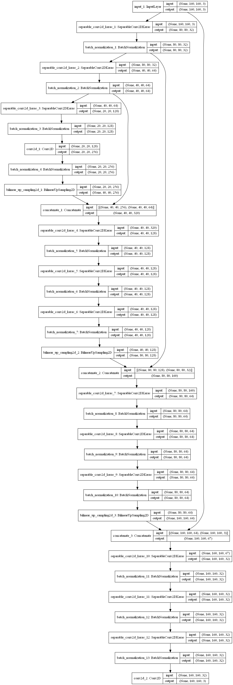
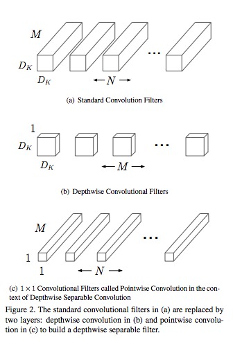
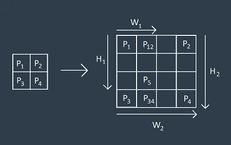
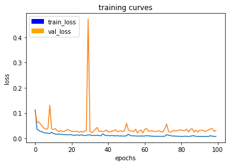

## Deep Learning Project ##

In this project, you will train a deep neural network to identify and track a target in simulation. So-called “follow me” applications like this are key to many fields of robotics and the very same techniques you apply here could be extended to scenarios like advanced cruise control in autonomous vehicles or human-robot collaboration in industry.

[image_0]: ./docs/misc/sim_screenshot.png
![alt text][image_0] 

## Neural Network Architecture ##
My network is an FCN network consists of following bokcks. 

* Encoder
Encoder is implemented in encoder_block function.
It used SeparableConv2DKeras and BatchNormalization.
And Encoder blocks are three with depth 32,64,128.

#### Separable Convolutions ####
The convolution neural net generally performs filtering on brute force between input and output channels.
So computational amount is O(WHNK^2M) with W(input width),H(input height),K(kernel size).
Depthwise separable convolution are made up of two layers: depthwise convolutions and pointwise convolutions.More details can be found [here](https://towardsdatascience.com/types-of-convolutions-in-deep-learning-717013397f4d).
With this technique the amount of calculation can theoretically be reduced to O(WHNM+WHNK^2).

* 1x1 Convolution
After the encoders I used a 1x1 convolution layer with 256 depth.

### 1x1 Convolution ####
A 1x1 convolutional layer is a mini-neural network of 1 pixel width and height. It is typically used between other convolution layers to increase the depth and number of parameters of a model without changing the structure of it. 

* Decoder
Decoder block consists of an upsampling layer,concatinate filter, and two separable_conv2d_batchnorm layers.

#### Upsampling ####
This block is the network to Upsample the decoded information from the previous block, so as to pass to a higher level decoder block.

#### Concatinate ####
In order to realize skip connection, the value of the convolution layer is learned according to the decoder layer.
This is a technique for learning deep convolution which began to be used from
[resnet](https://arxiv.org/abs/1512.03385).
Skip connections enable the network to use images from multiple resolution scales by connecting non-adjacent layers. This results in more precise semantic segmentation in the output image.

## Hyper Parameters ##
* Learning rate
The learning rate needs to be selected small enough so that Loss does not diverge.
First I choose 0.01 and it seems to small enough.

* Batch size
First I choose batch size 10.
But training time took a long time,
so I tried to make it as large as possible.
but due to memory constraints, it was set to 40 because out of memory occurred when it was 40 or more.

* Number of Epocks
I gradually increased the epoch , loss has not reduced at around 20.
Finaly I choose it to 100 so that it will be many epoch unless over learning.

## Results ##
With the above model and hyper-parameters, I achieved a final_score = 0.478099493142.
 The image below shows the loss curve for the last epoch of training. The final train_los = 0.0074 and val_loss = 0.0314

We can see that the average IoU for the hero is about 93% so the model does a pretty good job of identifying the hero from up close.
My simulators results is [here](./docs/misc/result.mp4)

#### IoU(intersection over union) ####
IoU is how much the target area g (ground truth box) is contained in the box b (box).
IoU(b,g)=area(b \bigcup g)/area(b \bigcap g)
The reward function R when performing action a in state s and transitioning to state s' using IoU is defined as follows.
R_{a}(s,s') = sign(IoU(b',g)-IoU(b,g))

## Analysys ##
Regarding the use of the same model and data to detect and follow other people or objects, this would not be possible for the current model since it has been trained for a particular image(hero). However, we could use the same network architecture to train and produce separate models for other objects we would want to be able to detect.

## Future Improvements ##
* Collect more image samples by simulator.
* Collect more image by data augumentation(movement, rotation, enlargement, background synthesis etc).
* Use other model like [Mask R-CNN].(https://arxiv.org/abs/1703.06870)